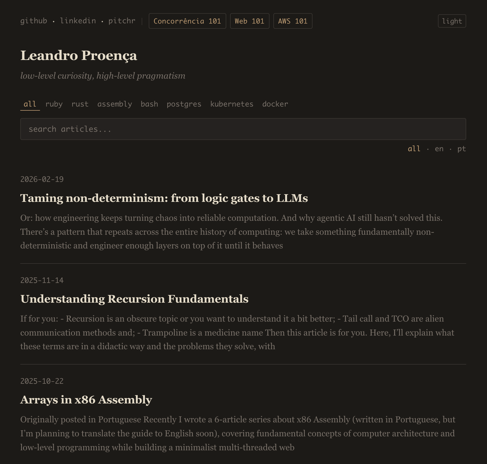

# DevTUI

Terminal markdown editor with live preview + multi-site static blog engine.

## Editor

Embeds vim via PTY with real-time markdown preview. Left pane is full vim. Right pane renders the markdown as you type.

```bash
make editor.build
./target/release/devtui mypost.md
```

Position sync uses vim's `titlestring` (zero file I/O). Content sync debounced via `CursorHold`. Mode detected from the terminal title.

All vim keybindings work. `Ctrl+D`/`Ctrl+U` for half-page scroll, `G`/`gg` for top/bottom, `:w` to save, `:q` to quit.

## Blog Engine

Multi-site static blog generator. See [docs/BLOG_ENGINE.md](docs/BLOG_ENGINE.md) for full documentation.

### Showcase

[](https://leandronsp.com)

[leandronsp.com](https://leandronsp.com) -- built with DevTUI's blog engine using the `paper` theme.

## Development

```bash
make test                     # all tests (147 tests, ~1s)
make editor.test              # editor tests only
make blog.test                # engine tests only
cargo clippy -- -D warnings   # lint
```

## Dependencies

### Editor

- [ratatui](https://ratatui.rs/) + [crossterm](https://github.com/crossterm-rs/crossterm) -- TUI framework
- [portable-pty](https://docs.rs/portable-pty) + [vt100](https://docs.rs/vt100) + [tui-term](https://docs.rs/tui-term) -- vim PTY embedding
- [pulldown-cmark](https://github.com/raphlinus/pulldown-cmark) -- markdown parsing

### Engine

- [pulldown-cmark](https://github.com/raphlinus/pulldown-cmark) -- markdown to HTML
- [toml](https://docs.rs/toml) + [serde](https://serde.rs/) -- config parsing
- [gh-emoji](https://docs.rs/gh-emoji) -- emoji shortcode conversion
- [tiny_http](https://docs.rs/tiny_http) -- local dev server
- **rsync** -- deploy only

### Install (macOS)

```bash
brew install vim
# Rust toolchain via rustup
```

## License

AGPL-3.0
